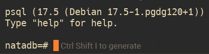
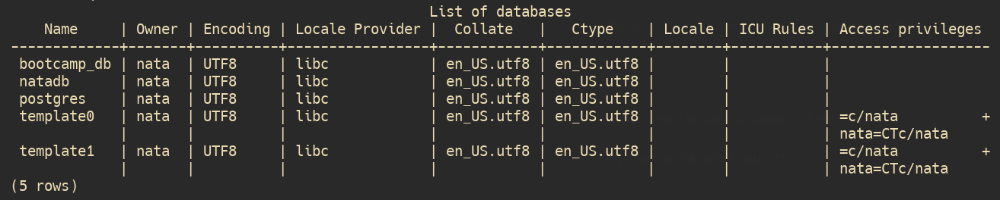
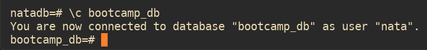
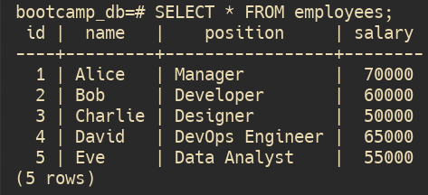
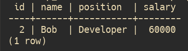
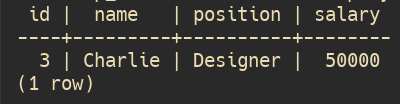
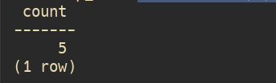
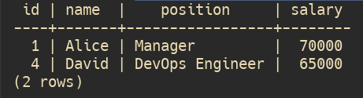
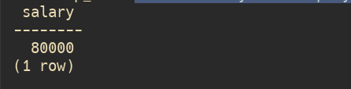
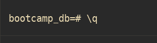

# db-bootcamp
Proyecto de Base de Datos Postgres conformado en Docker-Compose 

1. **Creamos una carpeta llamada "db-bootcamp"**

`mkdir db-bootcamp`
`cd db-bootcamp`

2. **Crea un archivo llamado docker-compose.yml en el directorio.**

`vim compose.yaml`

3. Configurar el servicio **postgres** de base de datos con una imagen de PostgreSQL dentro de docker-compose.yml para poder utilizarlo e interactuar con el contenedor.

Usaremos el siguiente compose:

	`services:`
	  `postgres:`
	    `image: postgres:latest`
	    `restart: no`
	    `shm_size: 128mb`
	    `environment:`
	      `POSTGRES_DB: natadb`
	      `POSTGRES_USER: nata`
	      `POSTGRES_PASSWORD: nata`
	    `volumes:`
	      `- postgres_data:/var/lib/postgresql/data`
	
	`volumes:`
	  `postgres_data:`

4. **Ingresar al contenedor y realizar una inyección de datos de pruebas:
    
- Crear una base de datos: “bootcamp_db”.

Ejecutamos el `docker exec` para poder ingresar a Postgres desde terminal:

`docker exec -it db-bootcamp-postgres-1 psql -U nata -d natadb`

Una vez dentro deberíamos ver el prompt de PostgreSQL y el nombre de la respectiva DB, algo así:

Ahora creamos la DB "bootcamp_db"

`CREATE DATABASE bootcamp_db;`

	
- Revisar con `\l` si se creó correctamente la base de datos:

Deberíamos de ver algo así:

    
- Conectarse a la base de datos: “`\c bootcamp_db`”:

Deberíamos de ver como ahora estamos conectados a la otra DB:

    
- Inyectar los siguientes datos:**

	`CREATE TABLE employees (`
		`id SERIAL PRIMARY KEY,`
		`name VARCHAR(50),`
		`position VARCHAR(50),`
		`salary INTEGER`
	`);`
	
	`INSERT INTO employees (name, position, salary) VALUES`
	`('Alice', 'Manager', 70000),`
	`('Bob', 'Developer', 60000),`
	`('Charlie', 'Designer', 50000),`
	`('David', 'DevOps Engineer', 65000),`
	`('Eve', 'Data Analyst', 55000);`

## Querys

- Realizar query que muestre todos los registros de la tabla employees.

`SELECT * FROM employees;`

- Realizar query que filtre empleados por posición Developer.

`SELECT * FROM employees WHERE position='Developer';`

    
- Realizar query que busque al empleado con ID 3.

`SELECT * FROM employees WHERE id=3;`

- Realizar query que cuente el número total de empleados.

`SELECT COUNT(*) FROM employees;`

- Realizar query que muestre los empleados con salario mayor a 60000.

`SELECT * FROM employees WHERE salary>60000;`

5. **Realizar query pero para mostrar todos los datos actualizados.**

A modo de prueba vamos a usar `UPDATE` para actualizar el salario del `name` con `id=1`:

`UPDATE employees`
`SET salary=80000` 
`WHERE id=1;`

Entonces tenemos que verificar que se hayan actualizados los cambios con:

`SELECT salary FROM employees` 
`WHERE id=1;`

Efectivamente vemos que actualizaron y ahora Alice tendría un salario más alto.

6. **Salir del contenedor con `\q` y luego exit.**

